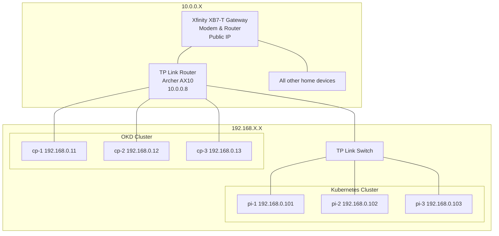

# HomeLab

```mermaid
graph TD
subgraph 10.0.0.X
A[Xfinity XB7-T Gateway<br/>Modem & Router<br/>Public IP]
A --- B
A --- J
J[All other home devices]
end
B[TP Link Router <br/>Archer AX10<br/>10.0.0.8]
B --- C
B --- D
B --- E
B --- F
subgraph 192.168.X.X
subgraph OKD Cluster
C["cp-1 192.168.0.11"]
D["cp-2 192.168.0.12"]
E["cp-3 192.168.0.13"]
end
F[TP Link Switch]
subgraph Kubernetes Cluster
G["pi-1 192.168.0.101"]
H["pi-2 192.168.0.102"]
I["pi-3 192.168.0.103"]
end
F --- G
F --- H
F --- I
end
```
