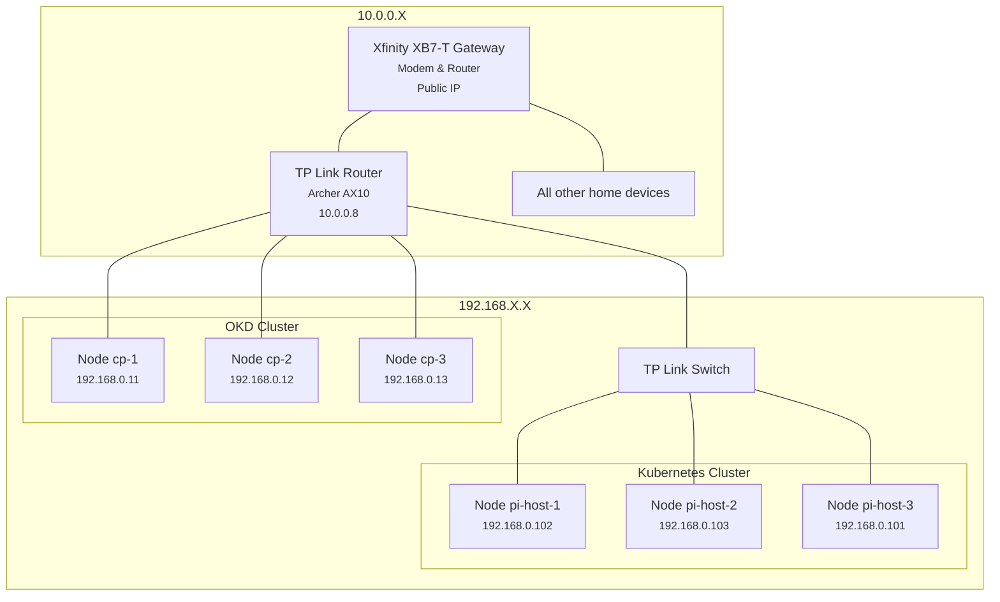

# HomeLab

```mermaid
graph TD
subgraph 10.0.0.X
A[Xfinity XB7-T Gateway<br/><small>Modem & Router</small><br/><small>Public IP</small>]
A --- B
A --- J
J[All other home devices]
end
B[TP Link Router <br/><small>Archer AX10</small><br/><small>10.0.0.8</small>]
B --- C
B --- D
B --- E
B --- F
subgraph 192.168.X.X
subgraph OKD Cluster
C[Node cp-1 <br/><small>192.168.0.11</small>]
D[Node cp-2 <br/><small>192.168.0.12</small>]
E[Node cp-3 <br/><small>192.168.0.13</small>]
end
F[TP Link Switch]
subgraph Kubernetes Cluster
G[Node pi-host-1 <br/><small>192.168.0.102</small>]
H[Node pi-host-2 <br/><small>192.168.0.103</small>]
I[Node pi-host-3 <br/><small>192.168.0.101</small>]
end
F --- G
F --- H
F --- I
end
```
